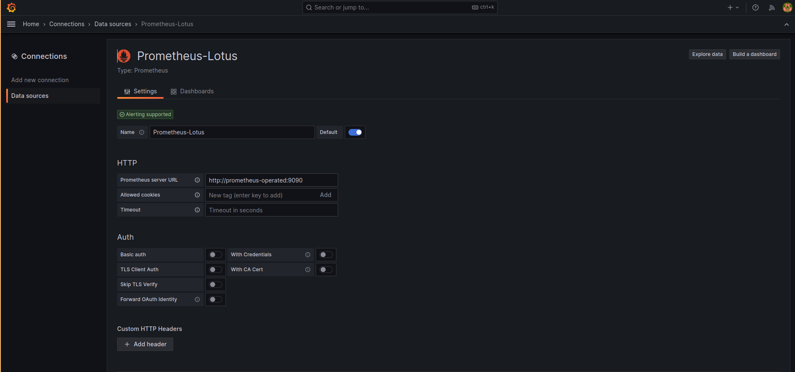

# Setup the Prometheus and Grafana
***Prometheus Setup***
---
> - ***Prometheus Installation***
```
 helm repo add prometheus-community https://prometheus-community.github.io/helm-charts            
 helm repo update                                                                                 
 helm install name prometheus-community/prometheus --namespace namepsace-name                     
```
> - *Check the status of the pods. Check the promethues server by doing the port forward* 
```
 kubectl port-forward svc/svc_name -n namespace-name localhost-port:pod-port        
 kubectl port-forward svc/prometheus-operated -n zerone-monitoring 9090:9090                      
```
**Setup the Grafana**
---
> - ***Grafana Installation***
```
 helm repo add grafana https://grafana.github.io/helm-charts                                      
 helm repo update                                                                                 
 helm install name grafana/grafana  --namespace namespace-name                                    
```
> - *Get the password of the grafana*
```
 kubectl  get secret grafana -n zerone-monitoring
 echo “password_value”  openssl base64 -d ; echo                                                 
 echo “username_value”  openssl base64 -d ; echo 
 kubectl port-forward svc/grafana -n zerone-monitoring 3000:3000 
```
> - Add the prometheus in the grafana dashboard.
```
Prometheus server URL:  http://prometheus-operated:9090
http://service-name:port
```



# Conclusion After Setting Up Prometheus and Grafana

Setting up Prometheus and Grafana is a powerful combination for monitoring and visualizing your infrastructure and applications. After completing the setup, you can draw several conclusions and benefits:

1. **Real-time Monitoring**: With Prometheus, you have a powerful monitoring system that collects and stores metrics in real-time. This allows you to keep a close eye on the health and performance of your systems.

2. **Alerting**: Prometheus provides alerting capabilities, allowing you to set up alerts based on predefined thresholds. You can be notified of issues before they become critical, helping you maintain system reliability.

3. **Historical Data**: Prometheus stores historical metric data, enabling you to analyze trends and identify long-term performance patterns. This data can be invaluable for capacity planning and troubleshooting.

4. **Custom Metrics**: You can instrument your applications and services to expose custom metrics, giving you deep insights into the specific aspects of your software that matter most to you.

5. **Grafana Dashboards**: Grafana offers a user-friendly interface for creating and customizing dashboards that visualize Prometheus data. These dashboards can provide at-a-glance information about the state of your systems.

6. **Data Correlation**: Grafana allows you to correlate data from multiple sources and display them in a single dashboard. This helps in diagnosing complex issues that involve multiple components.

7. **Flexibility**: Both Prometheus and Grafana are highly customizable. You can adapt them to suit your unique monitoring needs, whether you're running a small web application or a large-scale distributed system.

8. **Community Support**: Prometheus and Grafana have vibrant communities with active development and extensive documentation. You can find plugins, extensions, and support readily available online.

9. **Open Source**: Both Prometheus and Grafana are open-source projects, meaning you can use them without incurring licensing costs. This makes them an economical choice for monitoring your infrastructure.

10. **Scalability**: These tools are designed to scale horizontally, so you can expand your monitoring as your infrastructure grows.

11. **Integration**: Prometheus and Grafana can integrate with various other tools and services, allowing you to centralize your monitoring and combine it with other aspects of your DevOps stack.

In conclusion, setting up Prometheus and Grafana provides you with a robust monitoring and visualization solution that empowers you to maintain the health and performance of your systems, make data-driven decisions, and respond proactively to issues. It's a valuable addition to any organization's infrastructure management toolkit. However, to maximize its benefits, ongoing maintenance and tuning may be required to ensure it continues to meet your evolving monitoring needs.
