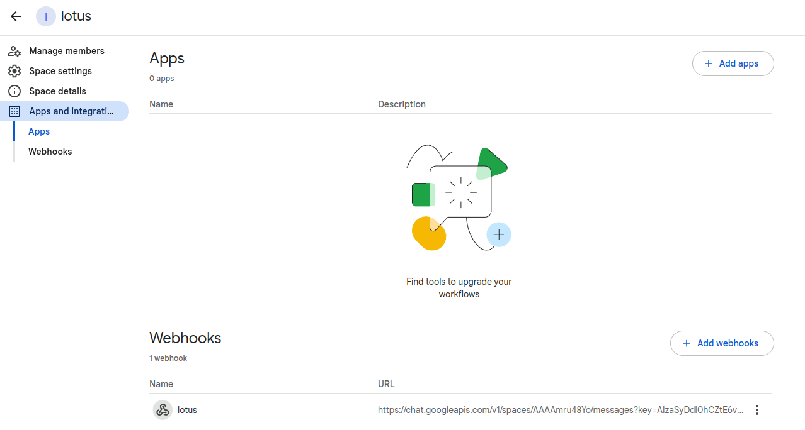
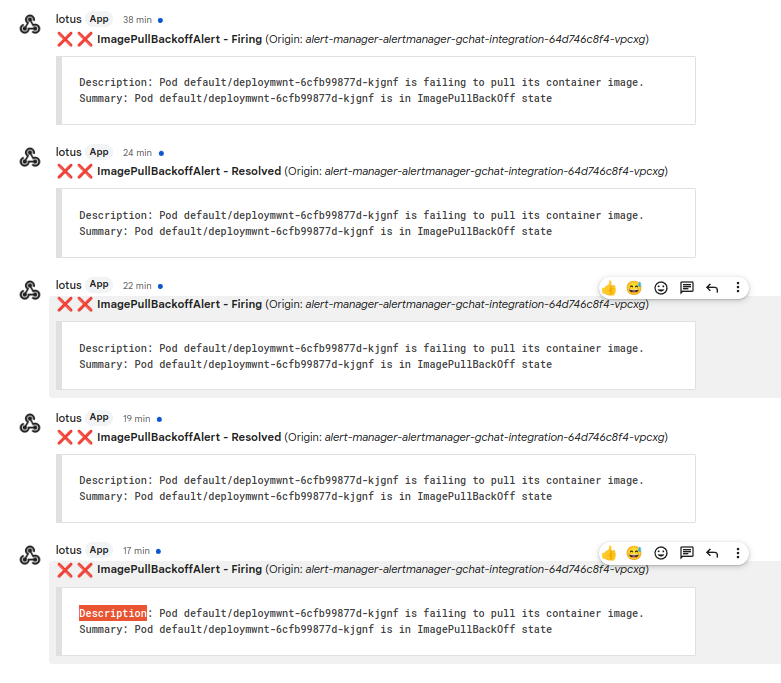

# Gmail Integration 

***Description***

  The application provides a Webhook integration for Prometheus AlertManager to push alerts to Google Chat rooms.

> - ***Prometheus Installation***
```
 helm repo add prometheus-community https://prometheus-community.github.io/helm-charts            
 helm repo update                                                                                 
 helm install name prometheus-community/prometheus --namespace namepsace-name    
```
- ***Alertmanager-gchat-integration***

    A web application which listens for Prometheus AlertManager alerts' and forward them to Google 
    Chat rooms.
```
 Install gchat manager using helm chart     
 helm repo add julb https://charts.julb.me 
 helm install name julb/alertmanager-gchat-integration  --namespace namespace-name
```
> - Add the Gmail Webook in the prometheus-community-alertmanager

```
url : ‘http://service.name(gchat-integration).namespace/alerts?room=lotus(roomname)’
apiVersion: v1
data:
  alertmanager.yml: |
    global:
      resolve_timeout: 1m
    route:
      group_by: ['alertname']
      group_wait: 10s
      group_interval: 10s
      repeat_interval: 1h
      receiver: 'gmail'
    receivers:
    - name: 'gmail'
      webhook_configs:
      - url: 'http://alert-manager-alertmanager-gchat-integration.zerone-monitoring/alerts?room=lotus'
    templates:
    - /etc/alertmanager/*.tmpl
kind: ConfigMap
metadata:
  annotations:
    kubectl.kubernetes.io/last-applied-configuration: |
      {"apiVersion":"v1","data":{"alertmanager.yml":"global:\n  resolve_timeout: 1m\nroute:\n  group_by: ['alertname']\n  group_wait: 10s\n  group_interval: 10s\n  repeat_interval: 1h\n  receiver: 'asd'\nreceivers:\n- name: 'asd'\n  webhook_configs:\n  - url: 'http://alert-manager-alertmanager-gchat-integration.zerone-monitoring.svc/alerts?room=lotus'\ntemplates:\n- /etc/alertmanager/*.tmpl\n"},"kind":"ConfigMap","metadata":{"annotations":{"meta.helm.sh/release-name":"prometheus-community","meta.helm.sh/release-namespace":"zerone-monitoring"},"creationTimestamp":"2023-09-19T16:33:26Z","labels":{"app.kubernetes.io/instance":"prometheus-community","app.kubernetes.io/managed-by":"Helm","app.kubernetes.io/name":"alertmanager","app.kubernetes.io/version":"v0.26.0","helm.sh/chart":"alertmanager-1.6.0"},"name":"prometheus-community-alertmanager","namespace":"zerone-monitoring","resourceVersion":"80702","uid":"c171403d-1beb-44a0-a39b-b62a7472695f"}}
    meta.helm.sh/release-name: prometheus-community
    meta.helm.sh/release-namespace: zerone-monitoring
  creationTimestamp: "2023-09-20T11:06:03Z"
  labels:
    app.kubernetes.io/instance: prometheus-community
    app.kubernetes.io/managed-by: Helm
    app.kubernetes.io/name: alertmanager
    app.kubernetes.io/version: v0.26.0
    helm.sh/chart: alertmanager-1.6.0
  name: prometheus-community-alertmanager
  namespace: zerone-monitoring
  resourceVersion: "95493"
  uid: c38ca1c3-0c69-48ea-8b3b-be724ab13c90
```

> - ***kubectl get cm prometheus–community-server -o yaml***

```
  alerting_rules.yml: |
    groups:
    - name: alertname
      rules:
      - alert: KubernetesNodeNotReady
        expr: kube_node_status_condition{condition="Ready",status="true"} == 0
        for: 10m
        labels:
          severity: critical
        annotations:
          summary: Kubernetes node not ready (instance {{ $labels.instance }})
          description: "Node {{ $labels.node }} has been unready for a long time\n  VALUE = {{ $value }}\n  LABELS = {{ $labels }}"
      - alert: KubernetesMemoryPressure
        expr: kube_node_status_condition{condition="MemoryPressure",status="true"} == 1
        for: 2m
        labels:
          severity: critical
        annotations:
          summary: Kubernetes memory pressure (instance {{ $labels.instance }})
          description: "{{ $labels.node }} has MemoryPressure condition\n  VALUE = {{ $value }}\n  LABELS = {{ $labels }}"
      - alert: KubernetesDiskPressure
        expr: kube_node_status_condition{condition="DiskPressure",status="true"} == 1
        for: 2m
        labels:
          severity: critical
        annotations:
          summary: Kubernetes disk pressure (instance {{ $labels.instance }})
          description: "{{ $labels.node }} has DiskPressure condition\n  VALUE = {{ $value }}\n  LABELS = {{ $labels }}"
      - alert: KubernetesNetworkUnavailable
        expr: kube_node_status_condition{condition="NetworkUnavailable",status="true"} == 1
        for: 2m
        labels:
          severity: critical
        annotations:
          summary: Kubernetes network unavailable (instance {{ $labels.instance }})
          description: "{{ $labels.node }} has NetworkUnavailable condition\n  VALUE = {{ $value }}\n  LABELS = {{ $labels }}"
      - alert: KubernetesOutOfCapacity
        expr: sum by (node) ((kube_pod_status_phase{phase="Running"} == 1) + on(uid) group_left(node) (0 * kube_pod_info{pod_template_hash=""})) / sum by (node) (kube_node_status_allocatable{resource="pods"}) * 100 > 90
        for: 2m
        labels:
          severity: critical
        annotations:
          summary: Kubernetes out of capacity (instance {{ $labels.instance }})
          description: "{{ $labels.node }} is out of capacity\n  VALUE = {{ $value }}\n  LABELS = {{ $labels }}"
      - alert: KubernetesContainerOomKiller
        expr: (kube_pod_container_status_restarts_total - kube_pod_container_status_restarts_total offset 10m >= 1) and ignoring (reason) min_over_time(kube_pod_container_status_last_terminated_reason{reason="OOMKilled"}[10m]) == 1
        for: 0m
        labels:
          severity: critical
        annotations:
          summary: Kubernetes container oom killer (instance {{ $labels.instance }})
          description: "Container {{ $labels.container }} in pod {{ $labels.namespace }}/{{ $labels.pod }} has been OOMKilled {{ $value }} times in the last 10 minutes.\n  VALUE = {{ $value }}\n  LABELS = {{ $labels }}"
      - alert: KubernetesPersistentvolumeclaimPending
        expr: kube_persistentvolumeclaim_status_phase{phase="Pending"} == 1
        for: 2m
        labels:
          severity: critical
        annotations:
          summary: Kubernetes PersistentVolumeClaim pending (instance {{ $labels.instance }})
          description: "PersistentVolumeClaim {{ $labels.namespace }}/{{ $labels.persistentvolumeclaim }} is pending\n  VALUE = {{ $value }}\n  LABELS = {{ $labels }}"
      - alert: KubernetesPodCrashLooping
        expr: increase(kube_pod_container_status_restarts_total[1m]) > 3
        for: 2m
        labels:
          severity: critical
        annotations:
          summary: Kubernetes pod crash looping (instance {{ $labels.instance }})
          description: "Pod {{ $labels.pod }} is crash looping\n  VALUE = {{ $value }}\n  LABELS = {{ $labels }}"
      - alert: ImagePullBackoffAlert
        expr: kube_pod_container_status_waiting_reason{reason="ImagePullBackOff"} == 1
        for: 1m
        labels:
          severity: critical
        annotations:
          summary: "Pod {{ $labels.namespace }}/{{ $labels.pod }} is in ImagePullBackOff state"
          description: "Pod {{ $labels.namespace }}/{{ $labels.pod }} is failing to pull its container image."
```                                         
                                             
> - ***Get the google chat space url***      



<br />
> - Encode  the following to base64.
```
[app.notification]
# Jinja2 custom template to print message to GChat.
custom_template_path = "/opt/alertmanager-gchat-integration/cm/notification-template-json.j2"
[app.room.lotus(google_space_name)]
notification_url = ‘<google_chat_space_url>’
```

> - Use the convert base64 code in the Secret (gchat-integration) && paste  in config.toml section
```
apiVersion: v1
data:
  config.toml: <Encoded base64 value>>
kind: Secret

```


> - After updating the Secret and ConfigMap we need to restart some Pod: 
```
    - alert-manager-alertmanager-gchat-integration
    - prometheus-community-alertmanager
    - prometheus-community-server
```

***Output***




